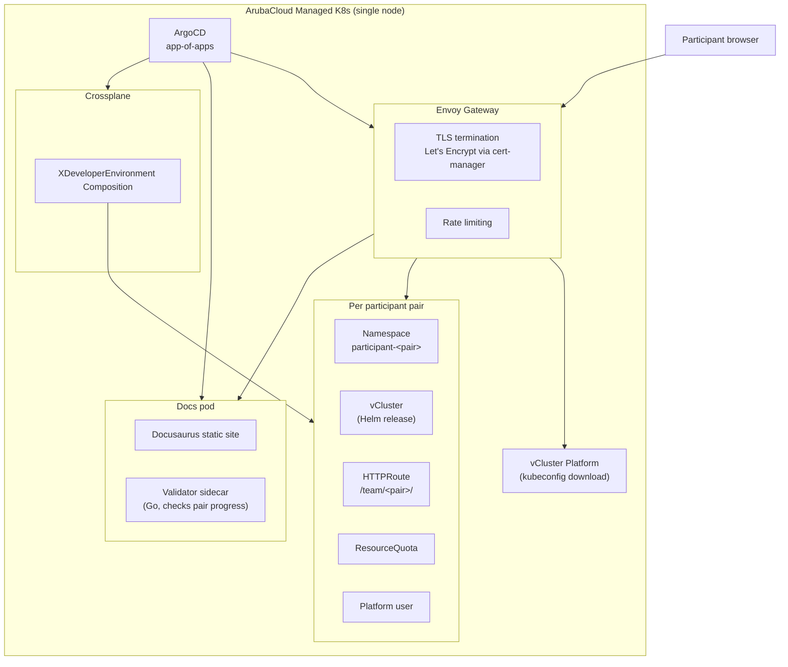

# Crossplane Workshop

Hands-on GitOps + Crossplane on Kubernetes.

A 3-hour workshop where participant pairs each get an isolated vCluster sandbox on a shared management cluster. The twist: at the end, participants discover their vCluster was itself provisioned by a Crossplane Composition -- the same pattern they just learned.

## Architecture overview



**Routing**: Envoy Gateway terminates TLS for `workshop.testdomain-riccap.it` and `platform.testdomain-riccap.it`. Per-pair traffic goes to `/team/<pair>/` (frontend) and `/team/<pair>/api/` (backend), routed via HTTPRoutes created by the XDeveloperEnvironment Composition.

## Prerequisites

| Tool | Purpose |
|------|---------|
| `docker` | Local vind cluster (vCluster Docker driver) |
| `helm` | ArgoCD, Envoy Gateway, vCluster Platform installs |
| `kubectl` | Cluster interaction |
| `task` ([go-task](https://taskfile.dev)) | All commands go through Taskfile |
| `vcluster` CLI (>= 0.31.0) | Local cluster, platform registration |
| `gh` CLI (authenticated) | Deploy key + GHCR pull secret provisioning |

The `gh` token needs the `read:packages` scope for the docs image pull secret:
```
gh auth refresh -h github.com -s read:packages
```

## Quick start

```
task bootstrap:all
```

This runs, in order:
1. **bootstrap:argocd** -- Helm install ArgoCD into the `argocd` namespace
2. **bootstrap:repo-credentials** -- Generate an ed25519 deploy key via `gh`, wire it into ArgoCD
3. **bootstrap:ghcr-pull-secret** -- Create a dockerconfigjson secret for pulling private docs/validator images from GHCR
4. **bootstrap:envoy-gateway** -- Helm install Envoy Gateway (OCI chart)
5. **bootstrap:vcluster-platform** -- Helm install vCluster Platform (prompts for admin password via `PLATFORM_ADMIN_PASSWORD`)
6. **bootstrap:root-app** -- Apply the root app-of-apps; ArgoCD takes over from here

After bootstrap, ArgoCD reconciles everything under `gitops/` automatically. Do not `kubectl apply` outside the documented tasks -- `selfHeal: true` will revert it.

For local development, use `task local:all` which creates a vind cluster first, then runs the full bootstrap.

### Solo local setup (k3d)

If you just want to walk through modules 02–06 on your own laptop — no vCluster, no ArgoCD,
no shared cluster — use the solo path:

```
task solo:all       # k3d up + Envoy Gateway + docs + HTTPRoute
# open http://localhost:8080/
task solo:down      # when you're done
```

Participants who haven't cloned this repo can follow the same steps from the published
docs at https://workshop.testdomain-riccap.it/solo-local-setup (plain `kubectl apply -f`
against the raw `gitops/solo/all.yaml`, public GHCR images, nothing else).

## Adding participants

1. Create a YAML file in `gitops/participant-claims/`:

```yaml
apiVersion: workshop.example.io/v1alpha1
kind: XDeveloperEnvironment
metadata:
  name: brave-mango
spec:
  pairId: brave-mango
```

2. Commit and push.

Crossplane reconciles the XDeveloperEnvironment into a namespace, vCluster Helm release, HTTPRoute, ResourceQuota, and Platform user within ~2 minutes. No tasks or manual steps.

To register new vclusters with the Platform UI, run `task platform:register-vclusters`.

## Workshop modules

The workshop targets **Crossplane v2 / UXP v2** — namespaced XRs, no claim layer, composition functions.

| Module | What participants do |
|--------|---------------------|
| **00 -- Intro** | Validate kubeconfig reaches their cluster (`cluster-reachable` check) |
| **01 -- Cheatsheet** | Reference: kubectl verbs, conditions, Crossplane terminology, Crossplane vs UXP |
| **02 -- Connect to your cluster** | Download the pair kubeconfig, export `KUBECONFIG`, apply a `hello` pod |
| **03 -- Install Crossplane** | Install UXP v2 via Helm with `webui.enabled=true` |
| **04 -- Providers & your first MR** | Install `provider-kubernetes`, apply a `ClusterProviderConfig`, create one `Object` MR wrapping a `ConfigMap` |
| **05 -- Define an Application** | Author a namespaced `CompositeResourceDefinition` + a `Composition` running `function-patch-and-transform`; apply one `Application` XR; tile lights up on the wall |
| **06 -- Modify your Application** | Edit the Composition or XR fields, watch the tile update live |
| **07 -- Wrap-up** | Recap, pointers to claims, Operations, Configuration packages |
| **99 -- Solo local setup (k3d)** | Reference page: how to run modules 02–06 on a laptop k3d cluster, no shared infra |

Each module ends with one or more validator checks (entries in `validator/checks.go`); the dashboard tile turns green when the matching cluster state is observed.

## Key URLs

| What | URL |
|------|-----|
| Docs site | https://workshop.testdomain-riccap.it/ |
| Wall (all tiles) | https://workshop.testdomain-riccap.it/wall |
| vCluster Platform | https://platform.testdomain-riccap.it/ |
| ArgoCD UI | `task argocd:ui` (port-forwards to https://localhost:8080) |
| Local gateway | `task wall:ui` (port-forwards to https://localhost:8443) |

## Taskfile reference

| Task | Description |
|------|-------------|
| `task` | List all available tasks |
| `task local:up` | Create local vind cluster (Docker driver) |
| `task local:down` | Delete local vind cluster |
| `task local:all` | Phase 1 one-shot: local cluster + full bootstrap |
| `task solo:up` | Create the solo k3d cluster (no vcluster, no ArgoCD) |
| `task solo:down` | Delete the solo k3d cluster |
| `task solo:platform` | Install Envoy Gateway + `gitops/solo` on the current context |
| `task solo:all` | Solo one-shot: k3d + Envoy Gateway + docs |
| `task solo:render` | Regenerate `gitops/solo/all.yaml` from the kustomize overlay |
| `task solo:verify` | Smoke check the solo stack |
| `task bootstrap:all` | Full bootstrap (ArgoCD + credentials + Envoy Gateway + Platform + root app) |
| `task bootstrap:argocd` | Install ArgoCD via Helm |
| `task bootstrap:repo-credentials` | Provision GitHub deploy key for ArgoCD |
| `task bootstrap:ghcr-pull-secret` | Provision GHCR pull secret for docs images |
| `task bootstrap:envoy-gateway` | Install Envoy Gateway |
| `task bootstrap:vcluster-platform` | Install vCluster Platform (needs `PLATFORM_ADMIN_PASSWORD`) |
| `task bootstrap:root-app` | Apply root app-of-apps |
| `task argocd:ui` | Port-forward ArgoCD UI to localhost:8080 |
| `task wall:ui` | Port-forward Envoy Gateway to localhost:8443 |
| `task platform:register-vclusters` | Register all vclusters with vCluster Platform |
| `task verify:pair PAIR=<id>` | Run checks for one participant pair |
| `task verify:all` | End-to-end check for all pairs |

## Security

- **HTTPS-only**: Envoy Gateway terminates TLS with Let's Encrypt certs via cert-manager. HTTP requests get a 301 redirect to HTTPS.
- **Rate limiting**: Per-source-IP local rate limiting (20 req/s) on all Gateway listeners.
- **vCluster isolation**: Each pair operates inside an isolated vCluster -- they cannot see or affect other pairs or the management cluster.
- **Scoped RBAC**: The validator ServiceAccount has read-only access limited to vCluster kubeconfig secrets and participant namespaces. No credentials reach the browser.
- **ResourceQuota**: Each participant namespace is capped (default: 2 CPU / 4Gi mem requests, 4 CPU / 8Gi mem limits, 30 pods).
- **GitOps-only**: After bootstrap, ArgoCD owns cluster state with `selfHeal: true`. Out-of-band changes are reverted automatically.
