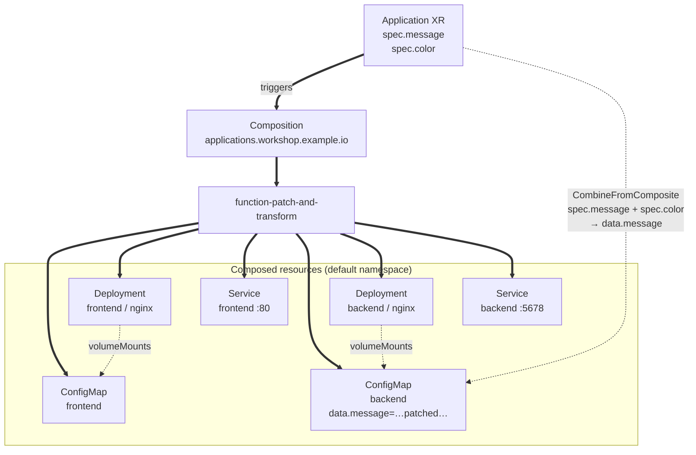

import PairId from '@site/src/components/PairId';
import ValidateCheck from '@site/src/components/ValidateCheck';

# Define an Application ⏱️ 30m

<PairId />

:::note Running solo locally?
Same cluster, same commands. Your tile at `/team/local/` will light up once the check passes. See [Solo local setup (k3d)](../solo-local-setup).
:::

## 5.1 Before you start ⏱️ 3m

This is the module where the workshop clicks together. You met the XRD-Composition-XR shape in [module 4](./first-composition) on a tiny `Hello` example — one XR fanned out into one ConfigMap. This module uses the same shape on something useful: a high-level `Application` kind that fans out into a frontend, a backend, and the ConfigMap that wires them together.

As a refresher: an XR triggers a Composition; the Composition's pipeline runs a function (`function-patch-and-transform` here, installed in module 4); the function's output is the desired-state YAML Crossplane then applies to the cluster.

The composition function from module 4 (`function-patch-and-transform`) is already installed. No new core-object types this module — but the Composition itself uses three new pipeline mechanics. Here's the shape, abbreviated:

```yaml
# inside spec.pipeline[0].input.resources, an array of any length:
resources:
  - name: backend-deployment       # internal label for this composed resource
    base:                          # the resource template — naked native kind
      apiVersion: apps/v1
      kind: Deployment
      ...
    patches:                       # connect XR fields → this resource's fields
      - type: CombineFromComposite # combine multiple XR fields via a format string
        combine: { ... }
        toFieldPath: data.message  # patches the backend ConfigMap, not the Deployment
    readinessChecks:               # when does Crossplane mark this Ready?
      - type: MatchCondition       # waits for Available=True (Deployments do this)
        matchCondition: { ... }
  - name: frontend-configmap
    base: { ... }
    readinessChecks:
      - type: None                 # "Ready as soon as observed" (ConfigMaps, Services)
```

You met `resources[]` (with one entry), `FromCompositeFieldPath` patches, and `readinessChecks: [- type: None]` in [module 4](./first-composition). New here: **multiple** `resources[]` entries, the **`CombineFromComposite`** patch type (formats multiple XR fields into one composed-resource field with a `printf`-style template), and **`MatchCondition`** readinessChecks (wait for a specific status condition rather than treating "observed" as Ready).

You're about to: apply an XRD, apply a Composition that uses all three of these mechanics, apply one XR, and watch a working two-tier app materialize on your tile.

## 5.2 Build the Application API ⏱️ 22m

### 1. Apply the XRD

The XRD declares your new API. `Application` will be **namespaced** (v2 default) with two fields: a `message` (required) and a `color` (optional, defaulted).

```bash
kubectl apply -f - <<'EOF'
apiVersion: apiextensions.crossplane.io/v2
kind: CompositeResourceDefinition
metadata:
  name: applications.workshop.example.io
spec:
  scope: Namespaced
  group: workshop.example.io
  names:
    kind: Application
    plural: applications
  versions:
    - name: v1alpha1
      served: true
      referenceable: true
      schema:
        openAPIV3Schema:
          type: object
          properties:
            spec:
              type: object
              properties:
                message:
                  type: string
                color:
                  type: string
                  default: "#2563eb"
              required:
                - message
EOF
```

Verify:

```bash
kubectl get xrd applications.workshop.example.io
```

Expected output:

```
NAME                                ESTABLISHED   OFFERED   AGE
applications.workshop.example.io    True                    5s
```

`ESTABLISHED=True` means the `Application` CRD is registered; you can now apply XRs. The `OFFERED` column stays empty because v2 does not generate a claim kind — in v1 it would show `True` if the XRD declared `claimNames`, but v2 lets you apply the XR directly so there's nothing to offer.

### 2. Apply the Composition

The Composition is the recipe. It creates six resources when an `Application` exists. The picture, then the table, then the YAML.

#### The fan-out, in one picture



The dashed arrow from the XR is the patch — the only place the XR's `message` and `color` fields actually flow into one of the composed resources. Everything else in the Composition is static template content. The two `volumeMounts` arrows are plain Kubernetes references (each Deployment mounts its ConfigMap by name) — nothing Crossplane-specific.

#### What this Composition produces

| Composed resource (`resources[].name`) | Base kind | Why it's there | Patches applied | Readiness check |
|---|---|---|---|---|
| `frontend-configmap` | `ConfigMap` | Holds the static HTML the frontend nginx serves. Ships an inline `<script>` that fetches `./api/message` and renders the JSON as the tile content | none — every `Application` gets the same HTML | `type: None` — ConfigMaps don't expose a Ready condition; treat as Ready on observation |
| `frontend-deployment` | `Deployment` | Runs `nginx:alpine`, mounts the ConfigMap above at `/usr/share/nginx/html` | none — the deployment shape is identical for every Application | `type: MatchCondition` waiting for `Available=True` |
| `frontend-service` | `Service` | Exposes the frontend on port 80; selected by `app: frontend`. The wall iframe targets `/team/<pair>/` which the workshop's HTTPRoute resolves to this Service | none | `type: None` |
| `backend-configmap` | `ConfigMap` | Holds the JSON body the frontend's JS fetches from `/api/message`. The XR's `message` and `color` flow into this ConfigMap's `data.message` field via the patch | **one** — `CombineFromComposite` writes a JSON-formatted string into `data.message` | `type: None` |
| `backend-deployment` | `Deployment` | Runs `nginx:alpine`, mounts `backend-configmap` at `/usr/share/nginx/html/api/` so requests to `/api/message` return the patched ConfigMap entry directly | none — the deployment shape is identical for every Application | `type: MatchCondition` waiting for `Available=True` |
| `backend-service` | `Service` | Exposes the backend on port 5678 externally; forwards to nginx on `targetPort: 80`. The HTTPRoute resolves `/team/<pair>/api/` to this Service | none | `type: None` |

The interesting wiring is the patch on `backend-configmap`. The XR ships two scalar fields:

```yaml
spec:
  message: "hello"
  color: "#10b981"
```

The frontend's JS fetches `./api/message` and expects a JSON body shaped like `{"message":"…","color":"…"}`. We don't need a server to compute that response — the `backend` Deployment is plain `nginx:alpine` and mounts `backend-configmap` at `/usr/share/nginx/html/api/`, so the file at `/api/message` *is* the ConfigMap's `data.message` entry. `CombineFromComposite` writes a JSON string into that entry with a `printf`-style template:

```yaml
patches:
  - type: CombineFromComposite
    combine:
      variables:
        - fromFieldPath: spec.message
        - fromFieldPath: spec.color
      strategy: string
      string:
        fmt: '{"message":"%s","color":"%s"}'
    toFieldPath: data.message
```

`toFieldPath` is the path inside the naked `ConfigMap` (compare to module 4's `Object`-MR shape, which would have prefixed it with `spec.forProvider.manifest.data.message`). At reconcile time, Crossplane substitutes the variables into the template and writes the result into `data.message`. nginx serves whatever's there.

#### Apply the YAML

```bash
kubectl apply -f - <<'EOF'
apiVersion: apiextensions.crossplane.io/v1
kind: Composition
metadata:
  name: applications.workshop.example.io
spec:
  compositeTypeRef:
    apiVersion: workshop.example.io/v1alpha1
    kind: Application
  mode: Pipeline
  pipeline:
    - step: patch-and-transform
      functionRef:
        name: function-patch-and-transform
      input:
        apiVersion: pt.fn.crossplane.io/v1beta1
        kind: Resources
        resources:
          - name: frontend-configmap
            base:
              apiVersion: v1
              kind: ConfigMap
              metadata:
                name: frontend
                namespace: default
              data:
                index.html: |
                  <!DOCTYPE html>
                  <html><head><meta charset="utf-8"><title>Tile</title>
                  <style>
                    body { font-family: sans-serif; margin: 0; padding: 20px; text-align: center; }
                    #title { font-size: 2rem; font-weight: 700; }
                  </style>
                  </head><body>
                  <div id="title">Loading...</div>
                  <script>
                    fetch('./api/message')
                      .then(r => r.text())
                      .then(txt => {
                        try {
                          const d = JSON.parse(txt);
                          const el = document.getElementById('title');
                          el.innerText = d.message || '(no message)';
                          if (d.color) el.style.color = d.color;
                        } catch (e) {
                          document.getElementById('title').innerText = 'Bad response: ' + txt;
                        }
                      })
                      .catch(e => {
                        document.getElementById('title').innerText = 'Error: ' + e.message;
                      });
                  </script>
                  </body></html>
            readinessChecks:
              - type: None
          - name: frontend-deployment
            base:
              apiVersion: apps/v1
              kind: Deployment
              metadata:
                name: frontend
                namespace: default
              spec:
                replicas: 1
                selector:
                  matchLabels: { app: frontend }
                template:
                  metadata:
                    labels: { app: frontend }
                  spec:
                    containers:
                      - name: nginx
                        image: public.ecr.aws/docker/library/nginx:alpine
                        ports:
                          - containerPort: 80
                        volumeMounts:
                          - name: html
                            mountPath: /usr/share/nginx/html
                    volumes:
                      - name: html
                        configMap:
                          name: frontend
            readinessChecks:
              - type: MatchCondition
                matchCondition:
                  type: Available
                  status: "True"
          - name: frontend-service
            base:
              apiVersion: v1
              kind: Service
              metadata:
                name: frontend
                namespace: default
              spec:
                selector: { app: frontend }
                ports:
                  - port: 80
                    targetPort: 80
            readinessChecks:
              - type: None
          - name: backend-configmap
            base:
              apiVersion: v1
              kind: ConfigMap
              metadata:
                name: backend
                namespace: default
              data:
                message: '{"message":"placeholder","color":"#2563eb"}'
            readinessChecks:
              - type: None
            patches:
              - type: CombineFromComposite
                combine:
                  variables:
                    - fromFieldPath: spec.message
                    - fromFieldPath: spec.color
                  strategy: string
                  string:
                    fmt: '{"message":"%s","color":"%s"}'
                toFieldPath: data.message
          - name: backend-deployment
            base:
              apiVersion: apps/v1
              kind: Deployment
              metadata:
                name: backend
                namespace: default
              spec:
                replicas: 1
                selector:
                  matchLabels: { app: backend }
                template:
                  metadata:
                    labels: { app: backend }
                  spec:
                    containers:
                      - name: nginx
                        image: public.ecr.aws/docker/library/nginx:alpine
                        ports:
                          - containerPort: 80
                        volumeMounts:
                          - name: api
                            mountPath: /usr/share/nginx/html/api
                    volumes:
                      - name: api
                        configMap:
                          name: backend
            readinessChecks:
              - type: MatchCondition
                matchCondition:
                  type: Available
                  status: "True"
          - name: backend-service
            base:
              apiVersion: v1
              kind: Service
              metadata:
                name: backend
                namespace: default
              spec:
                selector: { app: backend }
                ports:
                  - port: 5678
                    targetPort: 80
            readinessChecks:
              - type: None
EOF
```

One v2 quirk worth pointing out before you move on: the `CompositeResourceDefinition` above is `apiextensions.crossplane.io/v2`, but the `Composition` here is still `apiextensions.crossplane.io/v1`. That is **not a typo** — in Crossplane v2 the XRD API group bumped to `/v2` to express namespaced XRs, but `Composition` stays on `/v1`. Mixing them is expected.

### 3. Apply your Application XR

Now that the API exists, apply an instance. Change `message` to whatever you want — that's the text your tile will show.

```bash
kubectl apply -f - <<'EOF'
apiVersion: workshop.example.io/v1alpha1
kind: Application
metadata:
  name: wall-tile
  namespace: default
spec:
  message: "hello from <your pair>"
  color: "#10b981"
EOF
```

Watch everything materialize:

```bash
kubectl get application.workshop.example.io wall-tile -n default
kubectl get deploy,svc,cm -n default
```

Expected output (abridged):

```
NAME        SYNCED   READY   COMPOSITION                         AGE
wall-tile   True     True    applications.workshop.example.io    30s

NAME                       READY   UP-TO-DATE   AVAILABLE   AGE
deployment.apps/backend    1/1     1            1           25s
deployment.apps/frontend   1/1     1            1           25s
```

<ValidateCheck check="application-ready" />

When the tile turns green, open the [workshop wall](/wall) and click **Refresh** — your tile should light up with the colored message you put in the XR.

## 5.3 What just happened

You wrote one line of YAML — an `Application` — and got back a small running web app: a frontend, a backend, and the configuration that glues them together. Without Crossplane, the same outcome would have meant hand-writing six separate Kubernetes resources and keeping them consistent. Here, your one resource is the input, and Crossplane fans it out into the rest. The two custom fields you exposed (`message` and `color`) are the only knobs a developer needs to know about — everything else lives in the recipe.

You extended Kubernetes with an `Application` kind. One `kubectl apply` now fans out into six resources Crossplane composes directly: two Deployments, two Services, and two ConfigMaps. The XR's `message` and `color` fields flow through the Composition's patch into the backend ConfigMap's `data.message`, which nginx serves verbatim — so you have a typed, field-driven interface to a multi-resource stack, and you've stayed in the providerless v2 path you used in module 4.

That's Crossplane's central value: **compose your own APIs**, and let Kubernetes and providers do the rest.

### Go deeper

- [CompositeResourceDefinitions (docs.crossplane.io)](https://docs.crossplane.io/latest/concepts/composite-resource-definitions/) — every field an XRD can take.
- [Compositions (docs.crossplane.io)](https://docs.crossplane.io/latest/concepts/compositions/) — pipeline mode, function authoring.
- [function-patch-and-transform README](https://github.com/crossplane-contrib/function-patch-and-transform) — patch types, transforms, when to use what.
- [Namespaced XRs in v2](https://docs.crossplane.io/latest/whats-new/) — why the v1 claim layer is gone.
