import PairId from '@site/src/components/PairId';
import ValidateCheck from '@site/src/components/ValidateCheck';

# Definisci un'Application ⏱️ 30m

<PairId />

:::note Stai lavorando in solo, in locale?
Stesso cluster, stessi comandi. La tua tile su `/team/local/` si accenderà appena il check passa. Vedi [Setup locale solo (k3d)](../solo-local-setup).
:::

## 5.1 Prima di iniziare ⏱️ 3m

Questo è il modulo in cui il workshop fa clic. Hai incontrato la forma XRD-Composition-XR nel [modulo 4](./first-composition) su un piccolo esempio `Hello` — un XR si dirama in una ConfigMap. Questo modulo usa la stessa forma su qualcosa di utile: un kind di alto livello `Application` che si dirama in un frontend, un backend e la ConfigMap che li collega.

Come ripasso: un XR fa partire una Composition; la pipeline della Composition esegue una function (`function-patch-and-transform` qui, installata nel modulo 4); l'output della function è lo YAML di stato desiderato che Crossplane poi applica al cluster.

La composition function del modulo 4 (`function-patch-and-transform`) è già installata. Nessun nuovo tipo di core-object in questo modulo — ma la Composition stessa usa tre nuovi meccanismi di pipeline. Ecco la forma, abbreviata:

```yaml
# inside spec.pipeline[0].input.resources, an array of any length:
resources:
  - name: backend-deployment       # internal label for this composed resource
    base:                          # the resource template — naked native kind
      apiVersion: apps/v1
      kind: Deployment
      ...
    patches:                       # connect XR fields → this resource's fields
      - type: CombineFromComposite # combine multiple XR fields via a format string
        combine: { ... }
        toFieldPath: data.message  # patches the backend ConfigMap, not the Deployment
    readinessChecks:               # when does Crossplane mark this Ready?
      - type: MatchCondition       # waits for Available=True (Deployments do this)
        matchCondition: { ... }
  - name: frontend-configmap
    base: { ... }
    readinessChecks:
      - type: None                 # "Ready as soon as observed" (ConfigMaps, Services)
```

Hai incontrato `resources[]` (con una sola entry), le patch `FromCompositeFieldPath` e `readinessChecks: [- type: None]` nel [modulo 4](./first-composition). Novità qui: **più** entry in `resources[]`, il tipo di patch **`CombineFromComposite`** (formatta più campi dell'XR in un singolo campo della risorsa composta con un template stile `printf`) e i readinessChecks **`MatchCondition`** (aspettano una specifica status condition invece di trattare "osservato" come Ready).

Stai per: applicare un XRD, applicare una Composition che usa tutti e tre questi meccanismi, applicare un XR e guardare un'app a due livelli funzionante materializzarsi sulla tua tile.

## 5.2 Costruisci l'API Application ⏱️ 22m

### 1. Applica l'XRD

L'XRD dichiara la tua nuova API. `Application` sarà **namespaced** (default v2) con due campi: un `message` (obbligatorio) e un `color` (opzionale, con default).

```bash
kubectl apply -f - <<'EOF'
apiVersion: apiextensions.crossplane.io/v2
kind: CompositeResourceDefinition
metadata:
  name: applications.workshop.example.io
spec:
  scope: Namespaced
  group: workshop.example.io
  names:
    kind: Application
    plural: applications
  versions:
    - name: v1alpha1
      served: true
      referenceable: true
      schema:
        openAPIV3Schema:
          type: object
          properties:
            spec:
              type: object
              properties:
                message:
                  type: string
                color:
                  type: string
                  default: "#2563eb"
              required:
                - message
EOF
```

Verifica:

```bash
kubectl get xrd applications.workshop.example.io
```

Output atteso:

```
NAME                                ESTABLISHED   OFFERED   AGE
applications.workshop.example.io    True                    5s
```

`ESTABLISHED=True` significa che il CRD `Application` è registrato; ora puoi applicare XR. La colonna `OFFERED` resta vuota perché v2 non genera un kind di claim — in v1 mostrerebbe `True` se l'XRD dichiarasse `claimNames`, ma v2 ti lascia applicare l'XR direttamente, quindi non c'è niente da offrire.

### 2. Applica la Composition

La Composition è la ricetta. Crea sei risorse quando esiste un `Application`. L'immagine, poi la tabella, poi lo YAML.

#### Il fan-out, in un'immagine

```mermaid
flowchart TB
  xr["Application XR<br/>spec.message<br/>spec.color"]
  comp["Composition<br/>applications.workshop.example.io"]
  fn["function-patch-and-transform"]

  subgraph composed["Composed resources (default namespace)"]
    direction TB
    fcm["ConfigMap<br/>frontend"]
    fd["Deployment<br/>frontend / nginx"]
    fs["Service<br/>frontend :80"]
    bcm["ConfigMap<br/>backend<br/>data.message=…patched…"]
    bd["Deployment<br/>backend / nginx"]
    bs["Service<br/>backend :5678"]
  end

  xr == "triggers" ==> comp ==> fn
  fn ==> fcm & fd & fs & bcm & bd & bs
  xr -. "CombineFromComposite<br/>spec.message + spec.color<br/>→ data.message" .-> bcm
  fd -. "volumeMounts" .-> fcm
  bd -. "volumeMounts" .-> bcm
```



La freccia tratteggiata che parte dall'XR è la patch — l'unico punto in cui i campi `message` e `color` dell'XR effettivamente fluiscono dentro una delle risorse composte. Tutto il resto nella Composition è contenuto template statico. Le due frecce `volumeMounts` sono semplici riferimenti Kubernetes (ogni Deployment monta la sua ConfigMap per nome) — niente di specifico di Crossplane.

#### Cosa produce questa Composition

| Risorsa composta (`resources[].name`) | Base kind | Perché c'è | Patch applicate | Check di readiness |
|---|---|---|---|---|
| `frontend-configmap` | `ConfigMap` | Contiene l'HTML statico che il nginx frontend serve. Spedisce uno `<script>` inline che fa fetch di `./api/message` e renderizza il JSON come contenuto della tile | nessuna — ogni `Application` ottiene lo stesso HTML | `type: None` — le ConfigMap non espongono una Ready condition; trattate come Ready all'osservazione |
| `frontend-deployment` | `Deployment` | Esegue `nginx:alpine`, monta la ConfigMap qui sopra in `/usr/share/nginx/html` | nessuna — la shape del Deployment è identica per ogni Application | `type: MatchCondition` che aspetta `Available=True` |
| `frontend-service` | `Service` | Espone il frontend sulla porta 80; selezionato da `app: frontend`. L'iframe del wall punta a `/team/<pair>/` che la HTTPRoute del workshop risolve a questo Service | nessuna | `type: None` |
| `backend-configmap` | `ConfigMap` | Contiene il body JSON che il JS del frontend fa fetch da `/api/message`. I campi `message` e `color` dell'XR fluiscono nel campo `data.message` di questa ConfigMap via la patch | **una** — `CombineFromComposite` scrive una stringa formattata JSON in `data.message` | `type: None` |
| `backend-deployment` | `Deployment` | Esegue `nginx:alpine`, monta `backend-configmap` in `/usr/share/nginx/html/api/` così le richieste a `/api/message` ritornano la entry della ConfigMap patchata direttamente | nessuna — la shape del Deployment è identica per ogni Application | `type: MatchCondition` che aspetta `Available=True` |
| `backend-service` | `Service` | Espone il backend sulla porta 5678 esternamente; inoltra a nginx su `targetPort: 80`. La HTTPRoute risolve `/team/<pair>/api/` a questo Service | nessuna | `type: None` |

Il cablaggio interessante è la patch su `backend-configmap`. L'XR spedisce due campi scalari:

```yaml
spec:
  message: "hello"
  color: "#10b981"
```

Il JS del frontend fa fetch di `./api/message` e si aspetta un body JSON con la forma `{"message":"…","color":"…"}`. Non ci serve un server per calcolare quella risposta — il Deployment `backend` è semplice `nginx:alpine` e monta `backend-configmap` in `/usr/share/nginx/html/api/`, quindi il file in `/api/message` *è* la entry `data.message` della ConfigMap. `CombineFromComposite` scrive una stringa JSON in quella entry con un template stile `printf`:

```yaml
patches:
  - type: CombineFromComposite
    combine:
      variables:
        - fromFieldPath: spec.message
        - fromFieldPath: spec.color
      strategy: string
      string:
        fmt: '{"message":"%s","color":"%s"}'
    toFieldPath: data.message
```

`toFieldPath` è il path dentro la `ConfigMap` nuda (confronta con la shape MR `Object` del modulo 4, che lo avrebbe prefissato con `spec.forProvider.manifest.data.message`). Al momento della riconciliazione, Crossplane sostituisce le variabili nel template e scrive il risultato in `data.message`. nginx serve quello che trova lì.

#### Applica lo YAML

```bash
kubectl apply -f - <<'EOF'
apiVersion: apiextensions.crossplane.io/v1
kind: Composition
metadata:
  name: applications.workshop.example.io
spec:
  compositeTypeRef:
    apiVersion: workshop.example.io/v1alpha1
    kind: Application
  mode: Pipeline
  pipeline:
    - step: patch-and-transform
      functionRef:
        name: function-patch-and-transform
      input:
        apiVersion: pt.fn.crossplane.io/v1beta1
        kind: Resources
        resources:
          - name: frontend-configmap
            base:
              apiVersion: v1
              kind: ConfigMap
              metadata:
                name: frontend
                namespace: default
              data:
                index.html: |
                  <!DOCTYPE html>
                  <html><head><meta charset="utf-8"><title>Tile</title>
                  <style>
                    body { font-family: sans-serif; margin: 0; padding: 20px; text-align: center; }
                    #title { font-size: 2rem; font-weight: 700; }
                  </style>
                  </head><body>
                  <div id="title">Loading...</div>
                  <script>
                    fetch('./api/message')
                      .then(r => r.text())
                      .then(txt => {
                        try {
                          const d = JSON.parse(txt);
                          const el = document.getElementById('title');
                          el.innerText = d.message || '(no message)';
                          if (d.color) el.style.color = d.color;
                        } catch (e) {
                          document.getElementById('title').innerText = 'Bad response: ' + txt;
                        }
                      })
                      .catch(e => {
                        document.getElementById('title').innerText = 'Error: ' + e.message;
                      });
                  </script>
                  </body></html>
            readinessChecks:
              - type: None
          - name: frontend-deployment
            base:
              apiVersion: apps/v1
              kind: Deployment
              metadata:
                name: frontend
                namespace: default
              spec:
                replicas: 1
                selector:
                  matchLabels: { app: frontend }
                template:
                  metadata:
                    labels: { app: frontend }
                  spec:
                    containers:
                      - name: nginx
                        image: public.ecr.aws/docker/library/nginx:alpine
                        ports:
                          - containerPort: 80
                        volumeMounts:
                          - name: html
                            mountPath: /usr/share/nginx/html
                    volumes:
                      - name: html
                        configMap:
                          name: frontend
            readinessChecks:
              - type: MatchCondition
                matchCondition:
                  type: Available
                  status: "True"
          - name: frontend-service
            base:
              apiVersion: v1
              kind: Service
              metadata:
                name: frontend
                namespace: default
              spec:
                selector: { app: frontend }
                ports:
                  - port: 80
                    targetPort: 80
            readinessChecks:
              - type: None
          - name: backend-configmap
            base:
              apiVersion: v1
              kind: ConfigMap
              metadata:
                name: backend
                namespace: default
              data:
                message: '{"message":"placeholder","color":"#2563eb"}'
            readinessChecks:
              - type: None
            patches:
              - type: CombineFromComposite
                combine:
                  variables:
                    - fromFieldPath: spec.message
                    - fromFieldPath: spec.color
                  strategy: string
                  string:
                    fmt: '{"message":"%s","color":"%s"}'
                toFieldPath: data.message
          - name: backend-deployment
            base:
              apiVersion: apps/v1
              kind: Deployment
              metadata:
                name: backend
                namespace: default
              spec:
                replicas: 1
                selector:
                  matchLabels: { app: backend }
                template:
                  metadata:
                    labels: { app: backend }
                  spec:
                    containers:
                      - name: nginx
                        image: public.ecr.aws/docker/library/nginx:alpine
                        ports:
                          - containerPort: 80
                        volumeMounts:
                          - name: api
                            mountPath: /usr/share/nginx/html/api
                    volumes:
                      - name: api
                        configMap:
                          name: backend
            readinessChecks:
              - type: MatchCondition
                matchCondition:
                  type: Available
                  status: "True"
          - name: backend-service
            base:
              apiVersion: v1
              kind: Service
              metadata:
                name: backend
                namespace: default
              spec:
                selector: { app: backend }
                ports:
                  - port: 5678
                    targetPort: 80
            readinessChecks:
              - type: None
EOF
```

Una stranezza di v2 vale la pena tirare fuori prima di andare avanti: il `CompositeResourceDefinition` qui sopra è `apiextensions.crossplane.io/v2`, ma la `Composition` qui è ancora `apiextensions.crossplane.io/v1`. **Non è un typo** — in Crossplane v2 il group dell'API XRD è salito a `/v2` per esprimere XR namespaced, ma `Composition` resta su `/v1`. Mischiarli è atteso.

### 3. Applica il tuo XR Application

Ora che l'API esiste, applica un'istanza. Cambia `message` con quello che vuoi — è il testo che la tua tile mostrerà.

```bash
kubectl apply -f - <<'EOF'
apiVersion: workshop.example.io/v1alpha1
kind: Application
metadata:
  name: wall-tile
  namespace: default
spec:
  message: "hello from <your pair>"
  color: "#10b981"
EOF
```

Guarda tutto materializzarsi:

```bash
kubectl get application.workshop.example.io wall-tile -n default
kubectl get deploy,svc,cm -n default
```

Output atteso (abbreviato):

```
NAME        SYNCED   READY   COMPOSITION                         AGE
wall-tile   True     True    applications.workshop.example.io    30s

NAME                       READY   UP-TO-DATE   AVAILABLE   AGE
deployment.apps/backend    1/1     1            1           25s
deployment.apps/frontend   1/1     1            1           25s
```

<ValidateCheck check="application-ready" />

Quando la tile diventa verde, apri il [wall del workshop](/wall) e clicca **Refresh** — la tua tile dovrebbe accendersi con il messaggio colorato che hai messo nell'XR.

## 5.3 Cosa è appena successo

Hai scritto una riga di YAML — un `Application` — e in cambio hai ottenuto una piccola web app funzionante: un frontend, un backend e la configurazione che li collega. Senza Crossplane, lo stesso risultato avrebbe significato scrivere a mano sei risorse Kubernetes separate e tenerle coerenti. Qui, la tua singola risorsa è l'input, e Crossplane la espande nel resto. I due campi custom che hai esposto (`message` e `color`) sono le uniche manopole che uno sviluppatore deve conoscere — tutto il resto vive nella ricetta.

Hai esteso Kubernetes con un kind `Application`. Un `kubectl apply` adesso si dirama in sei risorse che Crossplane compone direttamente: due Deployment, due Service e due ConfigMap. I campi `message` e `color` dell'XR fluiscono attraverso la patch della Composition nel `data.message` della ConfigMap del backend, che nginx serve verbatim — quindi hai un'interfaccia tipata, guidata da campi, verso uno stack a più risorse, e sei rimasto sul percorso providerless v2 che hai usato nel modulo 4.

Quello è il valore centrale di Crossplane: **componi le tue API**, e lascia che Kubernetes e i Provider facciano il resto.

### Per approfondire

- [CompositeResourceDefinitions (docs.crossplane.io)](https://docs.crossplane.io/latest/concepts/composite-resource-definitions/) — ogni campo che un XRD può prendere.
- [Compositions (docs.crossplane.io)](https://docs.crossplane.io/latest/concepts/compositions/) — modalità pipeline, scrittura di function.
- [README di function-patch-and-transform](https://github.com/crossplane-contrib/function-patch-and-transform) — tipi di patch, transform, quando usare cosa.
- [XR namespaced in v2](https://docs.crossplane.io/latest/whats-new/) — perché il layer di claim v1 non c'è più.
