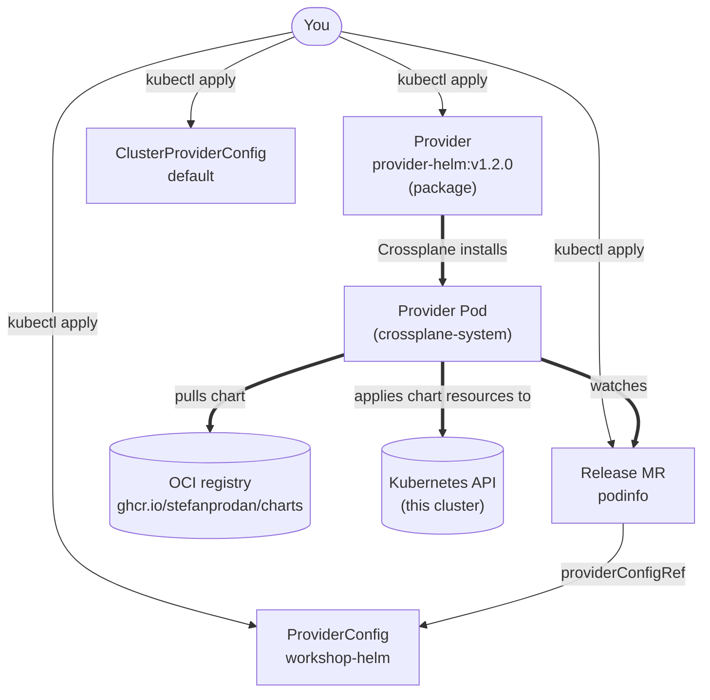

import PairId from '@site/src/components/PairId';
import ValidateCheck from '@site/src/components/ValidateCheck';

# Aggiungi un Provider ⏱️ 17m

<PairId />

:::note Stai lavorando in solo, in locale?
Stessi comandi, stesso cluster. Vedi [Setup locale solo (k3d)](../solo-local-setup).
:::

## 7.1 Prima di iniziare ⏱️ 3m

Finora ogni risorsa che hai composto è stata un **plain oggetto Kubernetes** — `ConfigMap`, `Deployment`, `Service`. Crossplane core stesso era il controller che le applicava. Non hai mai installato un Provider, e non te ne è servito uno per quel percorso.

Questa è solo metà di Crossplane. L'altra metà sono i **Provider**: pacchetti che insegnano a Crossplane a parlare con API *esterne* — SDK cloud, la CLI di Helm, cluster Kubernetes esterni, qualunque cosa con un Go SDK che qualcuno abbia incartato. Ogni Provider porta i propri kind custom (managed resource) che Crossplane riconcilia chiamando l'API esterna.

### Perché installare un Provider quando i moduli 4-6 non ne avevano bisogno?

Tre casi reali che la composition nativa non riesce a raggiungere:

- **Qualsiasi cosa fuori dall'API built-in di Kubernetes.** Le Function possono emettere kind nativi (Deployment, Service, ConfigMap), ma non possono parlare con AWS o GCP né renderizzare una Helm chart. Quelle hanno bisogno di un Provider che incarta l'SDK esterno.
- **Adottare una risorsa in-cluster esistente che non hai creato tu.** Le composition function creano risorse da zero. La MR `Object` di `provider-kubernetes` con `managementPolicies: [Observe]` ti permette di prendere la proprietà di una risorsa creata da qualcun altro, mirrorarne lo status, e solo poi iniziare a riconciliarla.
- **Puntare a un cluster o account diverso.** Un `ProviderConfig` può puntare a qualunque kubeconfig o credenziale cloud, non solo a quello in cui è installato Crossplane. Le flotte multi-cluster e multi-account viaggiano su questo.

`provider-helm` è l'esempio più amichevole da cui partire — la sua "API" esterna è `helm install` contro lo stesso cluster su cui sei già, così puoi ignorare gli aspetti cross-cluster e cloud-credential per ora e concentrarti sulla forma Provider/ProviderConfig/MR.

In questo modulo installerai [`provider-helm`](https://github.com/crossplane-contrib/provider-helm) — un Provider la cui "API" esterna è semplicemente `helm install` contro lo stesso cluster — e lo userai per installare la chart demo [podinfo](https://github.com/stefanprodan/podinfo) attraverso Crossplane.

### I pezzi — un veloce ripasso

Hai ormai visto la maggior parte dei componenti con cui è costruita una piattaforma Crossplane. Tre nuovi atterrano in questo modulo: **Provider**, **ProviderConfig** e **ClusterProviderConfig**. La colonna `Scope` divide una sottigliezza che la documentazione v1 glissava: un oggetto *che definisce* (CRD, XRD) è esso stesso cluster-scoped, ma il kind che definisce può essere namespaced o cluster-scoped a seconda del suo `spec.scope`.

| Componente | Cos'è | Chi lo crea | Scope dell'oggetto | Scope del kind che definisce / produce |
|---|---|---|---|---|
| **CRD** | Custom Resource Definition di Kubernetes. Estende l'API server con un nuovo kind. | Crossplane (auto-generato da un XRD); l'operator del cluster per quelli built-in | Cluster | `Namespaced` o `Cluster`, impostato in `spec.scope` del CRD |
| **XRD** | Composite Resource Definition — la tua dichiarazione di una nuova API Crossplane. Applicare un XRD fa sì che Crossplane generi il CRD corrispondente. | Tu (l'autore della piattaforma) | Cluster | `Namespaced` (default v2), `Cluster`, o `LegacyCluster` (compat v1 con claim), impostato in `spec.scope` |
| **XR** | Composite Resource — un'istanza di un XRD che innesca una Composition. | Utenti della piattaforma | A seconda dell'XRD — `Namespaced` in v2 di default | — |
| **Composition** | La ricetta. "Quando questo XR esiste, produci queste risorse." | Tu (l'autore della piattaforma) | Cluster | — |
| **Composition function** | Logica pluggable che la pipeline della Composition esegue per produrre lo stato desiderato (`function-patch-and-transform`, …). | L'autore del package della function; tu la installi | Cluster (è un package Crossplane, come un Provider) | — |
| **MR** | Managed Resource — una rappresentazione Kubernetes di una cosa esterna che un Provider riconcilia. | Crossplane (composta) o tu (direttamente) | Scelta per-Provider — la maggior parte dei provider v2 porta varianti namespaced in un API group `*.m.crossplane.io` accanto ai kind cluster-scoped legacy | — |
| **Provider** ← *nuovo questo modulo* | Un package che insegna a Crossplane a gestire una classe di API esterna (Helm, AWS, Kubernetes, …). | Lo installi da un registry; Crossplane esegue il controller | Cluster | — |
| **ProviderConfig** ← *nuovo questo modulo* | Configurazione runtime per-Provider (credenziali, endpoint target). Variante namespaced (in `*.m.crossplane.io` per i provider che si sono allineati a v2). | Tu | Namespaced | — |
| **ClusterProviderConfig** ← *nuovo questo modulo* | Configurazione runtime per-Provider — la variante cluster-scoped di v2, condivisa tra namespace. | Tu | Cluster | — |

### Un Provider a runtime, in una sola immagine



Un Provider è un package la cui installazione fa nascere un Pod long-running (frecce spesse: lavoro gestito da Crossplane). Il Pod osserva le MR dei suoi kind — `Release.helm.m.crossplane.io` qui — e traduce ognuna in chiamate verso un'API esterna (per `provider-helm` quell'"API" è l'SDK Helm che scarica chart e le applica all'apiserver dello stesso cluster).

Stai per: installare un Provider, configurarlo (con entrambe le varianti di `ProviderConfig`) e applicare una Managed Resource che installa una Helm chart.

## 7.2 Installa `provider-helm` ⏱️ 4m

Un Provider è semplicemente un altro package Crossplane. Applica il manifest, aspetta che diventi Healthy.

```bash
kubectl apply -f - <<'EOF'
apiVersion: pkg.crossplane.io/v1
kind: Provider
metadata:
  name: provider-helm
spec:
  package: xpkg.upbound.io/crossplane-contrib/provider-helm:v1.2.0
EOF
```

Aspetta che il package venga scaricato e che il pod del controller salga (~30 secondi):

```bash
kubectl wait --for=condition=Healthy provider/provider-helm --timeout=180s
```

Output atteso:

```
provider.pkg.crossplane.io/provider-helm condition met
```

`v1.2.0` conta: è la prima release stable che porta i kind ProviderConfig + Release **namespaced v2** (il group `helm.m.crossplane.io`, dove `.m.` segna namespaced). Le versioni 0.x hanno solo i kind cluster-scoped legacy; il resto di questo modulo non funziona su quelle.

### Concedi al provider il permesso di installare chart

`provider-helm` è un Pod a sé con il proprio ServiceAccount Kubernetes; i permessi di quel SA sono ciò che limita quali chart il provider può installare e dove. Di default non ne ha. Per installare Helm chart in namespace arbitrari, lega quel SA al ClusterRole built-in `cluster-admin`:

```bash
SA=$(kubectl get sa -n crossplane-system -o name | grep provider-helm | cut -d/ -f2)
kubectl create clusterrolebinding provider-helm-admin \
  --clusterrole=cluster-admin \
  --serviceaccount=crossplane-system:$SA
```

:::warning cluster-admin è da workshop
Stai dando al provider una credenziale molto ampia. In un cluster reale la stringeresti ai kind e ai namespace di cui le *tue* chart hanno bisogno (Deployment, Service, ConfigMap in un namespace specifico, ad esempio). Il tuo cluster del workshop è usa-e-getta, quindi il blast radius è zero — ma il pattern production-grade è un `Role` + `RoleBinding`.
:::

## 7.3 Configura il provider ⏱️ 4m

Un `ProviderConfig` dice al provider *come* autenticarsi alla sua API esterna. Per `provider-helm` l'"API esterna" è l'apiserver del cluster stesso, e il provider usa `InjectedIdentity` — il proprio token del ServiceAccount, nessun secret extra da gestire.

Crossplane v2 ha diviso `ProviderConfig` in due varianti:

| Kind | Scope | Usalo quando… |
|---|---|---|
| `ClusterProviderConfig` | Cluster | Una sola config che qualunque namespace può referenziare. La config "default" in un cluster single-tenant. |
| `ProviderConfig` | Namespaced | Una config per namespace, isolata dagli altri tenant. La scelta giusta quando le helm chart di ogni team puntano a un registry diverso o usano credenziali diverse. |

Per questo modulo applicherai entrambe — quella cluster-scoped per uso generale e una namespaced per dimostrare il pattern di isolamento di v2.

```bash
kubectl create namespace workshop-helm
kubectl apply -f - <<'EOF'
apiVersion: helm.m.crossplane.io/v1beta1
kind: ClusterProviderConfig
metadata:
  name: default
spec:
  credentials:
    source: InjectedIdentity
---
apiVersion: helm.m.crossplane.io/v1beta1
kind: ProviderConfig
metadata:
  name: workshop-helm
  namespace: workshop-helm
spec:
  credentials:
    source: InjectedIdentity
EOF
```

Verifica:

```bash
kubectl get clusterproviderconfigs.helm.m.crossplane.io
kubectl get providerconfigs.helm.m.crossplane.io -n workshop-helm
```

Output atteso (abbreviato):

```
NAME      AGE
default   2s

NAME            AGE
workshop-helm   2s
```

Ora hai due config valide. Il prossimo step sceglie quale usare.

## 7.4 Installa una Helm chart attraverso Crossplane ⏱️ 5m

Un `Release.helm.m.crossplane.io` è il kind **Managed Resource** namespaced che `provider-helm` v1.2.0 porta. Ogni `Release` corrisponde a un `helm install` — `forProvider` descrive la chart e i values, `providerConfigRef` punta alla config che il provider deve usare.

Usa il `ProviderConfig` namespaced che hai appena applicato:

```bash
kubectl apply -f - <<'EOF'
apiVersion: helm.m.crossplane.io/v1beta1
kind: Release
metadata:
  name: podinfo
  namespace: workshop-helm
spec:
  forProvider:
    chart:
      name: podinfo
      repository: oci://ghcr.io/stefanprodan/charts
      version: "6.7.1"
    namespace: workshop-helm
    values:
      replicaCount: 1
  providerConfigRef:
    kind: ProviderConfig
    name: workshop-helm
EOF
```

Due dettagli v2 da notare:

- **`providerConfigRef.kind` è obbligatorio** in v2 — le MR namespaced possono puntare *o* a un `ProviderConfig` nello stesso namespace *o* a un `ClusterProviderConfig`, quindi il kind deve essere esplicito. (Se cambi `kind: ProviderConfig` in `kind: ClusterProviderConfig` e `name: workshop-helm` in `name: default`, il Release riconcilierà contro la config cluster-scoped che hai applicato anche tu. Provalo dopo se sei curioso.)
- **La chart viene scaricata via OCI** (`oci://ghcr.io/stefanprodan/charts`). Non avviene nessun passo `helm repo add` — `provider-helm` emette direttamente un OCI pull. È lo stesso protocollo che Helm 3.8+ supporta nativamente.

Guarda il Release riconciliarsi:

```bash
kubectl get release.helm.m.crossplane.io -n workshop-helm
```

Output atteso:

```
NAME      CHART     VERSION   SYNCED   READY   STATE      REVISION   DESCRIPTION        AGE
podinfo   podinfo   6.7.1     True     True    deployed   1          Install complete   30s
```

`Ready=True, STATE=deployed` significa che la chart è installata. Il provider ha eseguito l'equivalente di `helm install podinfo …` e ha registrato la release nello stato del cluster.

Conferma che il workload sia davvero in esecuzione:

```bash
kubectl get deploy,svc -n workshop-helm
```

Output atteso:

```
NAME                      READY   UP-TO-DATE   AVAILABLE   AGE
deployment.apps/podinfo   1/1     1            1           45s

NAME              TYPE        CLUSTER-IP     EXTERNAL-IP   PORT(S)             AGE
service/podinfo   ClusterIP   10.43.x.x      <none>        9898/TCP,9999/TCP   45s
```

Colpisci l'endpoint `/api/info` di podinfo via un veloce port-forward:

```bash
kubectl port-forward -n workshop-helm svc/podinfo 9898:9898 &
sleep 2
curl -s http://localhost:9898/api/info | head -c 200
kill %1
```

Output atteso (abbreviato):

```json
{
  "hostname": "podinfo-…",
  "version": "6.7.1",
  "color": "#34577c",
  "message": "greetings from podinfo v6.7.1",
  …
}
```

<ValidateCheck check="helm-release-ready" />

Quando la tile diventa verde, Crossplane ha installato una vera Helm chart attraverso un Provider. Stesso contratto di lifecycle di un XR `XHello` o di un XR `XApplication` — `kubectl delete release podinfo -n workshop-helm` e la chart se ne va con lui.

## 7.5 Cosa è appena successo

Hai installato il tuo primo Provider. `provider-helm` ha esteso Crossplane con un nuovo kind di managed-resource (`Release.helm.m.crossplane.io`); un `ClusterProviderConfig` e un `ProviderConfig` hanno detto al provider come autenticarsi; una sola MR `Release` ha guidato `helm install` contro il cluster.

Il pattern è identico per ogni altro Provider nel [Crossplane Marketplace](https://marketplace.upbound.io/) — `provider-aws-s3`, `provider-gcp-storage`, `provider-azure-storage`, `provider-kubernetes`, decine altri. Il nome del package e i kind cambiano; la forma Provider → ProviderConfig → MR no.

Ora hai visto entrambe le metà di Crossplane:

- **Composition con una function** (moduli 4 + 5) — Crossplane core compone direttamente plain risorse Kubernetes. Nessun Provider serve.
- **Provider con una managed resource** (questo modulo) — un package Provider insegna a Crossplane a gestire un'API esterna.

Le piattaforme reali mescolano entrambe. Il track 2xx ha un modulo sull'adozione di risorse in-cluster *esistenti* via [`provider-kubernetes`](https://github.com/crossplane-contrib/provider-kubernetes) — stessa forma Provider/ProviderConfig/MR, superpotere diverso (`managementPolicies: [Observe]` per prendere la proprietà di risorse create da qualcun altro).

### Per approfondire

- [README di provider-helm](https://github.com/crossplane-contrib/provider-helm) — ogni campo su `Release.spec.forProvider`, incluse le patch di values e le strategie di version-pinning.
- [Crossplane Marketplace](https://marketplace.upbound.io/) — trova il Provider per il tuo cloud, SaaS o integrazione in-cluster preferiti.
- [Concetti dei Provider (docs.crossplane.io)](https://docs.crossplane.io/latest/concepts/providers/) — lifecycle di install dei package, vincoli di versione, runtime configuration.
